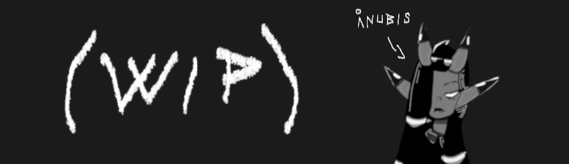

# (WIP name)



WORK IN PROGRESS, USE ON YOUR OWN RISK!

(WIP name) is Bedrock Linux inspired unix-like distribution.

true rolling release

[](https://gitpod.io/#https://github.com/Kreyrock/Kreyrock)

Flow chart https://www.yworks.com/yed-live/?file=https://raw.githubusercontent.com/Kreyrock/Kreyrock/master/docs/flowchart.xml

## Building

### Dependencies
- Standard UNIX utilities: grep, sed, awk, etc. <!-- more info needed -->
- gcc 4.9.1 or newer <!-- why -->
- git 1.8 or newer <!-- why -->
- meson 0.38 or newer <!-- why -->
- ninja-build <!-- why -->
- bison <!-- why -->
- libtool <!-- why -->
- autoconf <!-- why -->
- pkg-config <!-- why -->
- fakeroot <!-- why -->
- make <!-- We are using Makefile -->
- gzip <!-- why -->
- shellcheck (>0.4.0) <!-- Shellcheck source is used (https://github.com/koalaman/shellcheck/wiki/Directive#source/) -->
- shfmt <!-- To get faster runtime (benchmark needed) -->
- rsync <!-- why -->
- autopoint <!-- why -->
- gpg (optional) <!-- For signatures -->

Quick install:
```sh
# apt-based
sudo apt-get install -y meson gcc git ninja-build bison libtool libcap-dev autoconf pkg-config fakeroot gzip rsync uthash-dev libattr1-dev autopoint shellcheck && sudo wget https://github.com/mvdan/sh/releases/download/v3.0.0-beta1/shfmt_v3.0.0-beta1_linux_amd64 -O /usr/bin/shfmt && sudo chmod +x /usr/bin/shfmt
# Ubuntu
sudo apt-get -y install meson cppcheck libcap-dev clang libfuse3-dev gcc git ninja-build bison libtool autoconf pkg-config libcap-dev indent fakeroot libattr1-dev uthash-dev gzip rsync autopoint uthash-dev shellcheck && sudo wget https://github.com/mvdan/sh/releases/download/v3.0.0-beta1/shfmt_v3.0.0-beta1_linux_amd64 -O /usr/bin/shfmt && sudo chmod +x /usr/bin/shfmt
# Ubuntu <19 (FIXME: Missing libfuse3-dev)
sudo apt-get -y install meson cppcheck libcap-dev clang libfuse3-dev gcc git ninja-build bison libtool autoconf pkg-config libcap-dev indent fakeroot libattr1-dev uthash-dev gzip rsync autopoint uthash-dev shellcheck && sudo wget https://github.com/mvdan/sh/releases/download/v3.0.0-beta1/shfmt_v3.0.0-beta1_linux_amd64 -O /usr/bin/shfmt && sudo chmod +x /usr/bin/shfmt
# Debian
sudo apt-get install meson cppcheck clang libfuse3-dev gcc  libcap-devgit ninja-build bison libtool autoconf pkg-config libcap-dev indent libattr1-dev  fakeroot uthash-dev gzip rsync autopoint shellcheck -y && sudo wget https://github.com/mvdan/sh/releases/download/v3.0.0-beta1/shfmt_v3.0.0-beta1_linux_amd64 -O /usr/bin/shfmt && sudo chmod +x /usr/bin/shfmt
# FreeBSD - GCC (FIXME)
pkg install -y meson cppcheck fusefs-libs3 gcc git ninja bison libtool autoconf pkg-config indent fakeroot gzip rsync autopoint shellcheck
# FreeBSD - Clang (FIXME)
pkg install -y meson cppcheck clang fusefs-libs3 git ninja bison libtool autoconf pkg-config indent fakeroot gzip rsync autopoint shellcheck
# Portage-based - Clang
emerge -avuDNj dev-util/meson dev-util/cppcheck sys-devel/clang sys-fs/fuse dev-vcs/git dev-util/ninja sys-devel/bison sys-devel/libtool sys-devel/autoconf dev-ruby/pkg-config dev-util/indent sys-apps/fakeroot app-arch/gzip net-misc/rsync sys-devel/autoconf dev-util/shellcheck
# pacman-based
FIXME
# paludis-based - Clang
cave resolve sys-devel/meson dev-util/cppcheck sys-devel/clang sys-fs/fuse dev-scm/git sys-devel/ninja sys-devel/bison sys-devel/libtool sys-devel/autoconf dev-util/pkg-config dev-util/indent sys-apps/fakeroot app-arch/gzip net-misc/rsync sys-devel/autoconf dev-util/shellcheck -x
# paludis-based - GCC
cave resolve sys-devel/meson dev-util/cppcheck sys-devel/gcc sys-fs/fuse dev-scm/git sys-devel/ninja sys-devel/bison sys-devel/libtool sys-devel/autoconf dev-util/pkg-config dev-util/indent sys-apps/fakeroot app-arch/gzip net-misc/rsync sys-devel/autoconf dev-util/shellcheck -x
# MacOSX (FIXME)
brew install shellcheck cppcheck shfmt
# Cygwin (FIXME)
FIXME
```

### Actual building
Ensure you have internet access (to fetch upstream dependencies), then run:
```sh
make GPGID=<gpg-id-with-which-to-sign>
```

to build a signed install/update script or
```sh
make SKIPSIGN=true
```

to build an unsigned install/update script.

The build process can be customized in the same fashion as most make and C
projects:

- You may use `-jN` to tell make to parallelize the build process with `N`
  jobs.
- You may set `CFLAGS` to pass flags to the C compiler such as `-Os` and
  `-march=native`.
	- Bedrock's components **MUST** be statically compiled.  The build system
	  sets `-static` in various places.  Do not set `-dynamic` or otherwise
	  try to change away from a static build (FIXME, implement dynamic).

This will produce a script such as:

```
(WIP name)-<OS>-<version>-<arch>.sh
```

## Installation

- Install another, traditional Linux distribution(FIXME, build from scratch).
	- Select a filesystem which supports extended filesystem attributes.
- Setup users, networking, etc as one would typically do.
- Reboot into the fresh install.
- Get the `(WIP name)-<OS>-<version>-<arch>.sh` script onto the system by building it locally
- Run the script as root with the `--hijack <name>` argument (name is optional).
- Follow the prompts.
- Reboot.  Re-select the new install at any bootloader prompt.
- You're now running (WIP name), but with only the initial install's files. To leverage (WIP name)'s features, we need other distribution's files as well.
- Run `brl fetch --list` to see the various distributions which (WIP name) knows how to fetch or build from source/scratch.
- As root, run `brl fetch <fetcher>` to acquire upstream distribution files.
	- If this fails, you may need to manually look up release and mirror information for the desired distribution and provide the information with `--release` and `--mirror` flags.

====

Basic usage
-----------

A Bedrock Linux system is composed of "strata".  These are collections of
interrelated files.  These are often, but not always, one-to-one with other,
traditional Linux distributions.  Bedrock integrates these strata together,
creating a single, largely cohesive system with desirable features from other
distributions.

To list the currently installed (and enabled) strata, run:

	$ brl list

To list distros which can be easily acquired as strata, run:

	$ brl fetch --list

To acquire new strata, run (as root):

	# brl fetch <distros>

Once that has completed, you may run commands from the new strata.  For
example, the following series of commands make sense on a Bedrock system:

	$ sudo brl fetch arch debian
	$ sudo pacman -S mupdf && sudo apt install texlive
	$ man pdflatex
	$ pdflatex preexisting-file.tex && mupdf preexisting-file.pdf

Bedrock's integration is not limited to the command line.  For example,
graphical application menus or launchers will automatically pick up
applications across strata, and Xorg fonts installed from one stratum will be
picked up in an X11 graphical application from another stratum.

If there are multiple instances of an executable, Bedrock will select one by
default in a given context.  If there are hints it can pick up on for which one
to use, it is normally correct.  `brl which` can be used to query which Bedrock
will select in a given context.  For example:

	$ # arch, debian, and centos are installed.
	$ # running debian's init, and thus must use debian's reboot
	$ sudo brl which -b reboot
	debian
	$ # only arch provides pacman, so arch's pacman will be used
	$ brl which -b pacman
	arch
	$ # yum is a python script.  Since yum comes from centos, the python
	$ # interpreter used to run yum will also come from centos.
	$ sudo yum update
	^Z
	$ brl which $(pidof python | cut -d' ' -f1)
	centos

If you would like a specific instance, you may select it with `strat`:

	$ # arch, debian, and ubuntu are installed
	$ # install vlc from arch
	$ sudo pacman -S vlc
	$ # install vlc from debian
	$ sudo strat debian apt install vlc
	$ # install vlc from ubuntu
	$ sudo strat ubuntu apt install vlc
	$ # run default vlc
	$ vlc /path/to/video
	$ # run arch's vlc
	$ strat arch vlc /path/to/video
	$ # run debian's vlc
	$ strat debian vlc /path/to/video
	$ # run ubuntu's vlc
	$ strat ubuntu vlc /path/to/video

To avoid conflicts, processes from one stratum may see its own stratum's
instance of a given file.  For example, Debian's `apt` and Ubuntu's `apt` must
both see their own instance of `/etc/apt/sources.list`.  Other files must be
shared across strata to ensure they work together, and thus all strata see the
same file.  For example, `/home`.  Such shared files are referred to as
"global".  Which stratum provides a file in a given context can be queried by
`brl which`:

	$ # which stratum is my shell from?
	$ brl which --pid $$
	gentoo
	$ # that query is common enough the PID may be dropped
	$ brl which
	gentoo
	$ # which stratum provides ~/.vimrc
	$ brl which --filepath ~/.vimrc
	global
	$ # global indicates all stratum seem the same file; not specific to any
	$ # stratum.
	$ brl which --filepath /bin/bash
	gentoo
	$ brl which --bin pacman
	arch

If you would like to specify which non-global file to read or write, prefix
`/bedrock/strata/<stratum>/` to its path.

	$ brl which --filepath /bedrock/strata/debian/etc/apt/sources.list
	debian
	$ brl which --filepath /bedrock/strata/ubuntu/etc/apt/sources.list
	ubuntu
	$ # edit debian's sources.list with ubuntu's vi
	$ strat ubuntu vi /bedrock/strata/debian/etc/apt/sources.list

`brl` provides much more functionality which can be read from `brl --help`.

A concrete list of everything Bedrock can integrate, work-arounds for known
limitations, and other useful information may be found at bedrocklinux.org.

===

## Resources

- Website: WIP
- IRC: WIP
	- https://webchat.freenode.net/?channels=WIP
- Github: https://github.com/WIP
